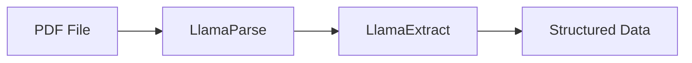
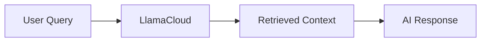
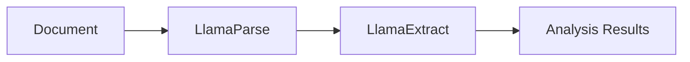

# n8n LlamaCloud Nodes

This repository contains custom n8n nodes for integrating with [LlamaCloud](https://cloud.llamaindex.ai/?utm_source=demo&utm_medium=n8n), providing powerful document processing and retrieval capabilities within your n8n workflows.

## 🚀 Features

This package includes three custom nodes:

### 📄 **[LlamaParse](https://www.llamaindex.ai/llamaparse?utm_source=demo&utm_medium=n8n)**
- Parse PDF files and extract their content in markdown format
- Uses LlamaCloud's document parsing capabilities
- Perfect for document preprocessing workflows

### 🔍 **[LlamaExtract](https://www.llamaindex.ai/llamaextract?utm_source=demo&utm_medium=n8n)** 
- Extract structured data from files using LlamaCloud extraction agents
- Get elegant, structured information from documents
- Ideal for data extraction and analysis workflows

### 💬 **[LlamaCloud](https://www.llamaindex.ai/llamacloud?utm_source=demo&utm_medium=n8)**
- Retrieve context from your LlamaCloud indexes
- Chat with your indexed documents
- Great for building RAG (Retrieval-Augmented Generation) applications

## 📋 Prerequisites

Before using these nodes, you need:

1. **Node.js and npm** (Minimum version Node 20)
> You can find instructions on how to install both using 
nvm (Node Version Manager) for Linux, Mac, and WSL [here](https://github.com/nvm-sh/nvm). For 
Windows users, refer to Microsoft's guide to [Install NodeJS on Windows](https://docs.microsoft.com/en-us/windows/dev-environment/javascript/nodejs-on-windows).

2. **n8n** installed globally
   ```bash
   npm install n8n -g
   ```

3. **LlamaCloud API Key**
   - Sign up at [cloud.llamaindex.ai](https://cloud.llamaindex.ai/?utm_source=demo&utm_medium=n8n)
   - Get your API key from the dashboard

## 🛠️ Installation

### Option 1: Local Development (Recommended)

1. **Clone this repository**
   ```bash
   git clone https://github.com/run-llama/n8n-llamacloud.git
   cd n8n-llamacloud
   ```

2. **Install dependencies**
   ```bash
   npm install
   ```

3. **Build the nodes and publish locally**
   ```bash
   npm run build
   npm link
   ```

4. **Link to n8n custom nodes directory**
   ```bash
   # Create custom nodes directory if it doesn't exist
   mkdir -p ~/.n8n/custom
   npm link n8n-nodes-llamacloud
   ```

5. **Restart n8n**
   ```bash
   n8n start
   ```

### Option 2: Global Installation

1. **Install globally**
   ```bash
   npm install -g @llamaindex/n8n-nodes-llamacloud
   cd  ~/.n8n/custom
   npm link @llamaindex/n8n-nodes-llamacloud
   ```

2. **Restart n8n**
   ```bash
   n8n start
   ```

## 🔧 Setup

### 1. Configure LlamaCloud Credentials

1. Open n8n in your browser (usually `http://localhost:5678`)
2. Go to **Settings** → **Credentials**
3. Click **Add Credential**
4. Search for **"LlamaCloud API Key"**
5. Enter your LlamaCloud API key 
6. Test the connection and save

### 2. Create LlamaCloud Indexes (for LlamaCloud node)

1. Go to [cloud.llamaindex.ai](https://cloud.llamaindex.ai/?utm_source=demo&utm_medium=n8n)
2. Create a new project
3. Upload documents to create an index
4. Note the index name for use in the LlamaCloud node

## 📚 Resources
- [LlamaCloud Documentation](https://docs.cloud.llamaindex.ai/utm_source=demo&utm_medium=n8n)
- [LlamaIndex Documentation](https://docs.llamaindex.ai/utm_source=demo&utm_medium=n8n)
- [n8n Documentation](https://docs.n8n.io/)
- [n8n Community](https://community.n8n.io/)


## 📖 Usage Examples

### Example 1: Document Processing Pipeline



**Workflow:**
1. **LlamaParse** node: Parse a PDF file to markdown
2. **LlamaExtract** node: Extract structured data using an extraction agent
3. Use the structured data in subsequent nodes

### Example 2: RAG Chat Application



**Workflow:**
1. **HTTP Request** node: Receive user query
2. **LlamaCloud** node: Retrieve relevant context from your index
3. **OpenAI** node: Generate response using the retrieved context

### Example 3: Document Analysis



**Workflow:**
1. **LlamaParse** node: Convert document to markdown
2. **LlamaExtract** node: Extract specific information (e.g., dates, amounts, entities)
3. **Code** node: Process and analyze the extracted data

## 🔍 Node Details

### LlamaParse Node

**Purpose:** Parse PDF files and extract content in markdown format

**Parameters:**
- **File Path** (required): Path to the PDF file to parse
  - Example: `/Users/username/Documents/document.pdf`

**Output:** Markdown content of the parsed document

### LlamaExtract Node

**Purpose:** Extract structured data from files using LlamaCloud extraction agents

**Parameters:**
- **Agent ID** (required): The ID of your LlamaCloud extraction agent
- **File Path** (required): Path to the file to extract data from

**Output:** Structured data based on your extraction agent's configuration

### LlamaCloud Node

**Purpose:** Retrieve context from your LlamaCloud indexes

**Parameters:**
- **Index Name** (required): Name of your LlamaCloud index
- **Chat Input** (from previous node): The query to search for in your index

**Output:** Retrieved context from your index
