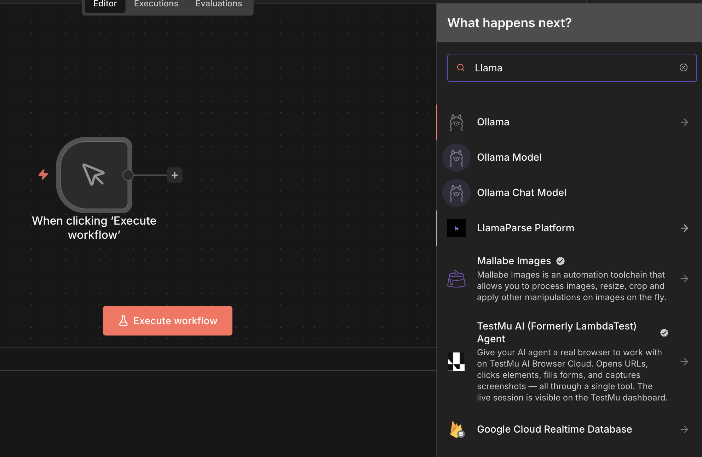
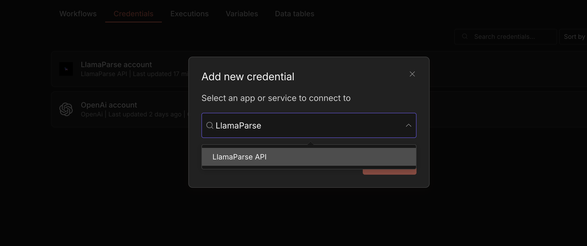
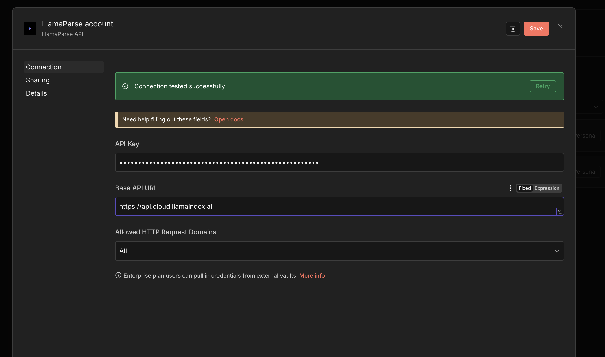

# Setting up the LlamaParse Platform node for n8n

In order to set up the LlamaParse Platform node for n8n, you first need to install the associated package via `npm` (or another package manager of the Javascript/Typescript ecosystem):

```bash
npm install -g @llamaindex/n8n-nodes-llamacloud
```

Once installed, you can go to your `$HOME/.n8n` directory and link the node package from there:

```bash
cd $HOME/.n8n
mkdir custom/
cd custom/
npm link @llamaindex/n8n-nodes-llamacloud
```

And then you can start n8n:

```bash
n8n start
```

And the LlamaParse Platform node will be available:



In order to interact with the node, you will need credentials (grab or create yours from the [LlamaParse Platform](https://cloud.llamaindex.ai)).

On n8n's dashboard, select "Create Credentials" and then select "LlamaParse API":



Paste your API key and, optionally, specify a base URL for the API, and save:



---

### View Also:

- [Parse n8n setup](./llamaparse.md)
- [Index v1 n8n setup](./llamacloud_index.md)
- [Extract Setup](./llamaextract.md)
- [Classify n8n setup](./llamaclassify.md)
- [Split n8n setup](./llamasplit.md)
- [Setup with Docker](./docker.md)
- [Back to top](#setting-up-llamacloud-nodes-for-n8n)
