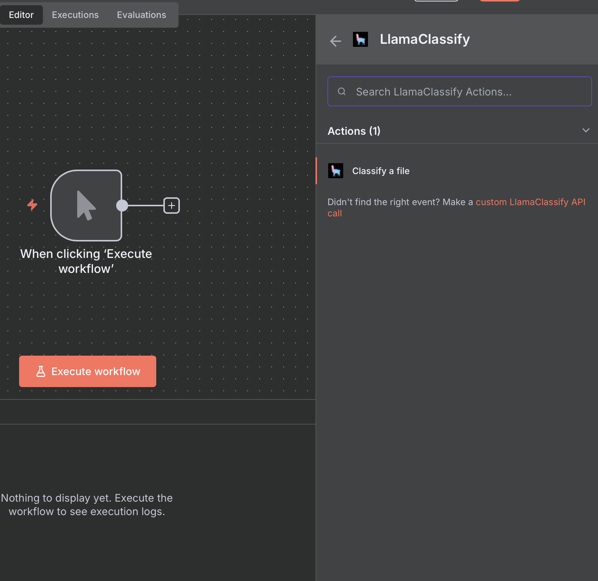
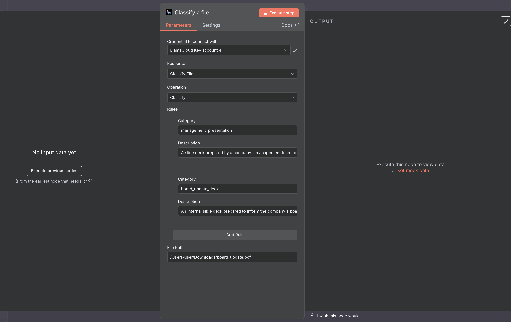

# LlamaClassify Setup in n8n

## Setup

Select the 'LlamaClassify' node with the 'Classify a file' action.

When setting up the node, you should provide:

- A set of rule, with:
	+ **category**: the category the rule refers to. Must be lowercase and without spaces.
	+ **description**: a description of what the category refers to.
- The path to the file.

As for LlamaParse, you can also set the node to receive inputs from other nodes, such as a n8n form.

---

### View Also:

- [LlamaParse n8n setup](./llamaparse.md)
- [LlamaCloud Index setup](./llamacloud_index.md)
- [LlamaExtract n8n setup](./llamaextract.md)
- [LlamaSheets n8n setup](./llamasheets.md)
- [Setting up LlamaCloud nodes](./index.md)
- [Back to top](#llamaclassify-setup-in-n8n)
