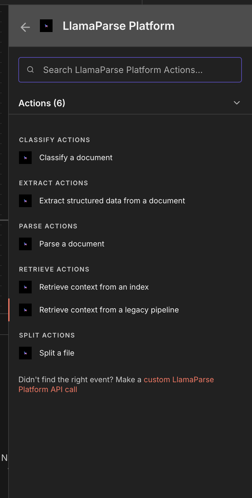

# Index v1 setup in n8n

## Prerequisites

In order to use Index v1 (legacy) in n8n, you need to create an Index on the LlamaParse Platform.

Learn how to set up an Index from the [Platform UI](https://developers.llamaindex.ai/llamaparse/cloud-index/getting_started/#set-up-an-index-via-ui) or through [code](https://developers.llamaindex.ai/llamaparse/cloud-index/guides/api_sdk/).

## Setup

The Index v1 action is specifically designed for chat inputs, so you will first need to set up a Chat Trigger:

You can select the 'Retrieve context from legacy pipelines' action from the LlamaParse Platform node:

And paste the ID of your LlamaCloud Index in the configuration field and, optionally, the top K chunks to retrieve:

Once that is set, you can use the chat messages as input for Index v1 to retrieve information simply by connecting the nodes, and the you can start chatting:

_Image using [Index v2](./llamacloud_indexv2.md)_

---

### View Also:

- [Parse n8n setup](./llamaparse.md)
- [Extract Setup](./llamaextract.md)
- [Classify n8n setup](./llamaclassify.md)
- [Split n8n setup](./llamasplit.md)
- [Index v2 n8n setup](./llamacloud_indexv2.md)
- [Setting up LlamaParse Platform nodes](./index.md)
- [Setup with Docker](./docker.md)
- [Back to top](#llamacloud-index-setup-in-n8n)
