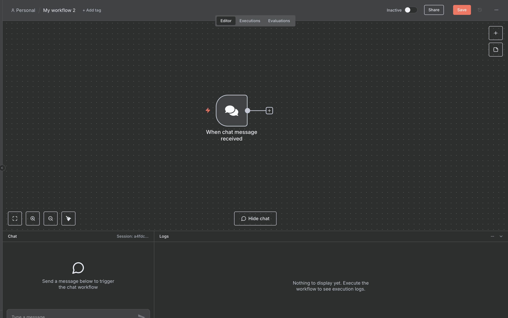
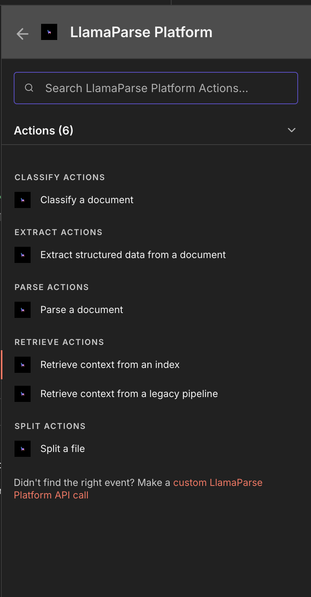
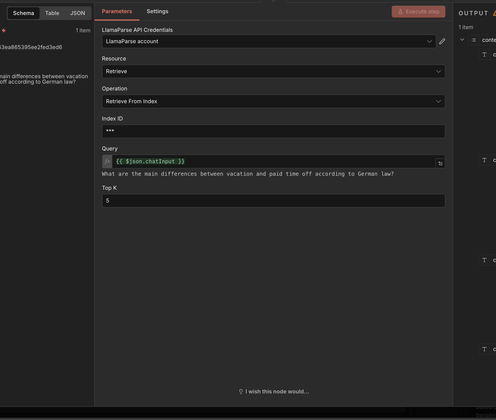
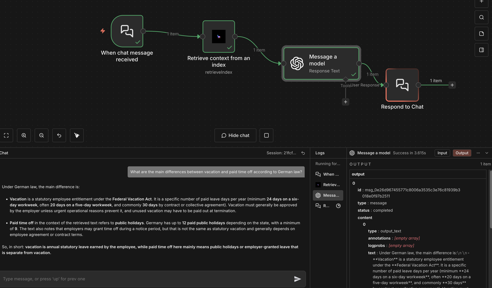

# Index v2 setup in n8n

## Prerequisites

In order to use Index v2 in n8n, you need to create an Index on LlamaCloud.

Learn how to set up an Index with v2 settings from [code](https://developers.llamaindex.ai/llamaparse/cloud-index-v2/getting_started/).

## Setup

The Index v2 action is specifically designed for chat inputs, so you will first need to set up a Chat Trigger:

You can select the 'Retrieve from index' action from the LlamaParse Platform node:

And parse the ID of your LlamaCloud Index in the configuration field, and, optionally, the top K chunks to retrieve:

Once that is set, you can use the chat messages as input for the Index v2 to retrieve information simply by connecting the nodes, and the you can start chatting:

---

### View Also:

- [Parse n8n setup](./llamaparse.md)
- [Extract Setup](./llamaextract.md)
- [Classify n8n setup](./llamaclassify.md)
- [Index v1 n8n setup](./llamacloud_index.md)
- [LlamaSplit n8n setup](./llamasplit.md)
- [Setting up LlamaParse Platform nodes](./index.md)
- [Setup with Docker](./docker.md)
- [Back to top](#llamacloud-index-setup-in-n8n)
