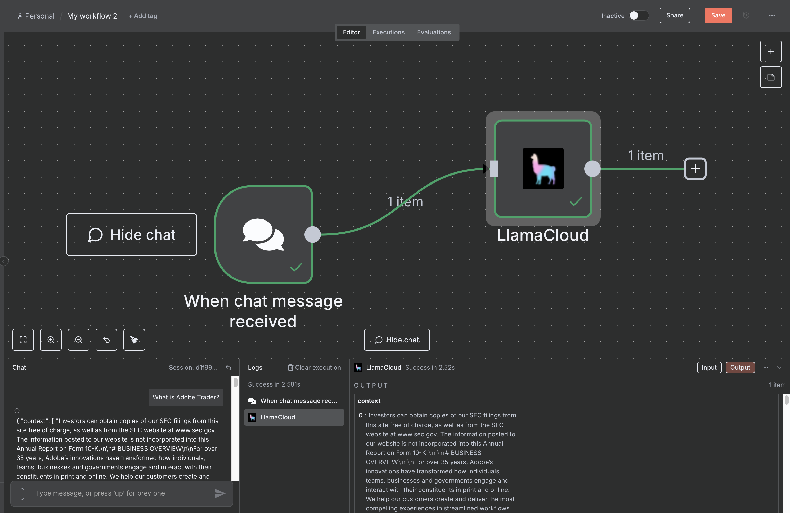

# LlamaCloud Index v2 setup in n8n

## Prerequisites

In order to use LlamaCloud Index in n8n, you need to create an Index on LlamaCloud.

Learn how to set up an Index with v2 settings from [code](https://developers.llamaindex.ai/llamaparse/cloud-index-v2/getting_started/).

## Setup

The LlamaCloud Index V2 node is specifically designed for chat inputs, so you will first need to set up a Chat Trigger:

And then you can select the 'LlamaCloud Index v2' node, pasting the ID of your LlamaCloud Index in the configuration field, and, optionally, the top K chunks to retrieve:

Once that is set, you can use the chat messages as input for the LlamaCloud Index to retrieve information simply by connecting the two nodes, and the you can start chatting:

---

### View Also:

- [LlamaParse n8n setup](./llamaparse.md)
- [LlamaExtract Setup](./llamaextract.md)
- [LlamaClassify n8n setup](./llamaclassify.md)
- [LlamaCloud Index v1 n8n setup](./llamacloud_index.md)
- [LlamaSheets n8n setup](./llamasheets.md)
- [Setting up LlamaCloud nodes](./index.md)
- [Setup with Docker](./docker.md)
- [Back to top](#llamacloud-index-setup-in-n8n)
