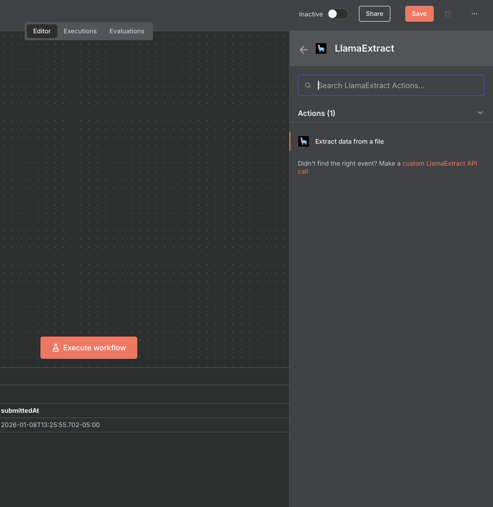
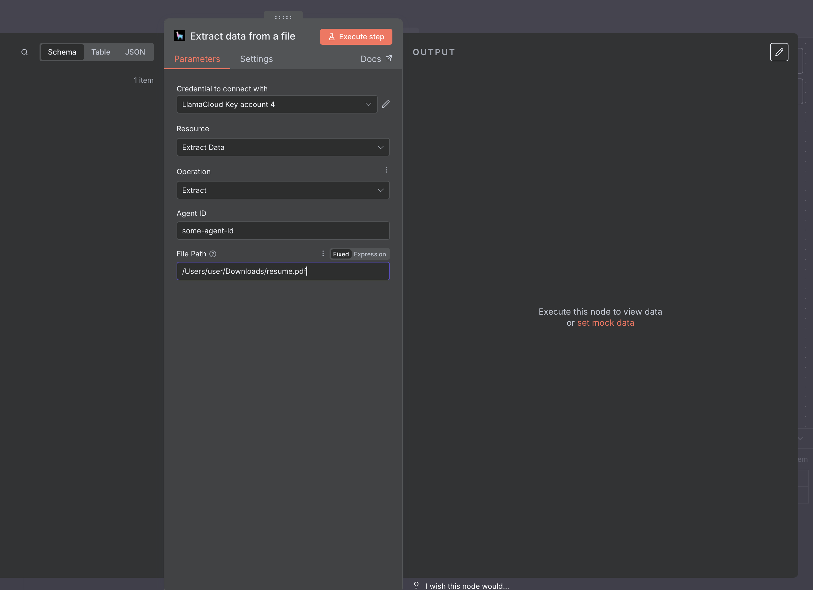

# LlamaExtract Setup in n8n

## Prerequisites

In order to make LlamaExtract work, you need to first create an Extraction Agent on LlamaCloud Platform with your designed schema.

With python code (current SDK), that looks like:

```python
from pydantic import BaseModel, Field
from llama_cloud import LlamaCloud, AsyncLlamaCloud

# Define schema using Pydantic
class Resume(BaseModel):
    name: str = Field(description="Full name of candidate")
    email: str = Field(description="Email address")
    skills: list[str] = Field(description="Technical skills and technologies")

client = LlamaCloud(api_key="your_api_key")

# Create extraction agent
agent = client.extraction.extraction_agents.create(
    name="resume-parser",
    data_schema=Resume,
    config={}
)

# retrieve agent ID for future usage
print(agent.id)
```

With the legacy SDK, you can do:

```python
from llama_cloud_services import LlamaExtract
from pydantic import BaseModel, Field

# Initialize client
extractor = LlamaExtract(api_key="your_llama_cloud_api_key")

# Define schema using Pydantic
class Resume(BaseModel):
    name: str = Field(description="Full name of candidate")
    email: str = Field(description="Email address")
    skills: list[str] = Field(description="Technical skills and technologies")

# Create extraction agent
agent = extractor.create_agent(name="resume-parser", data_schema=Resume)

# retrieve agent ID for future usage
print(agent.id)
```

You can also configure your agents from the [LlamaCloud Platform UI](https://developers.llamaindex.ai/python/cloud/llamaextract/getting_started/web_ui/).

## Setup

Select the 'LlamaExtract' node with the 'Extract data from a file' action.



When setting up the node, pass your Agent ID (copy it from the LlamaCloud Platform UI or from the outputs of the code snippets), and the path to a file:



As for LlamaParse, you can also set the node to receive inputs from other nodes, such as a n8n form.

---

### View Also:

- [LlamaParse n8n setup](./llamaparse.md)
- [LlamaCloud Index setup](./llamacloud_index.md)
- [LlamaClassify n8n setup](./llamaclassify.md)
- [LlamaSheets n8n setup](./llamasheets.md)
- [Setting up LlamaCloud nodes](./index.md)
- [Back to top](#llamaextract-setup-in-n8n)
