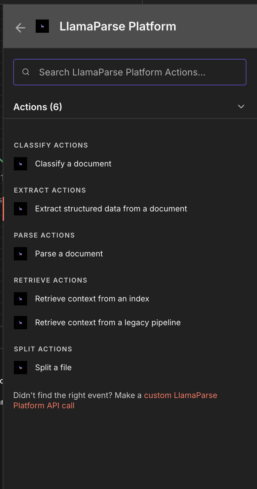
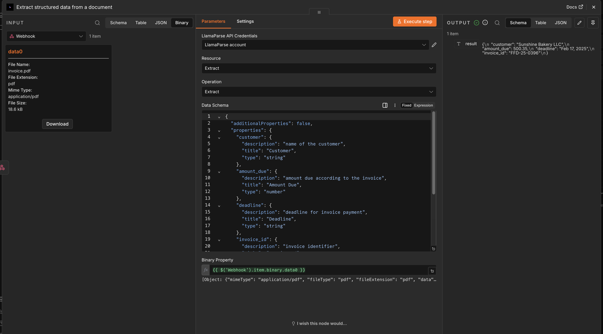

# Extract Setup in n8n

## Setup

Select the 'Extract structured data from a document' action from the LlamaParse Platform node:

When setting up the action, define a JSON schema that the extracted data should follow, and the binary data of file:

As for Parse, you can also set the node to receive inputs from other nodes, such as a webhook.

---

### View Also:

- [Parse n8n setup](./llamaparse.md)
- [Index v2 n8n setup](./llamacloud_indexv2.md)
- [Classify n8n setup](./llamaclassify.md)
- [Split n8n setup](./llamasplit.md)
- [Setting up LlamaParse Platform nodes](./index.md)
- [Setup with Docker](./docker.md)
- [Back to top](#llamaextract-setup-in-n8n)
