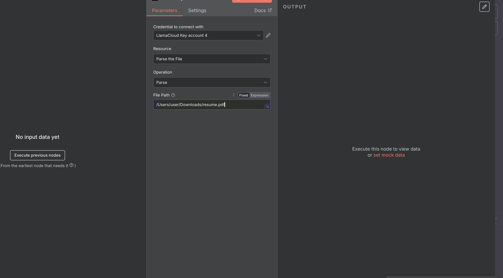
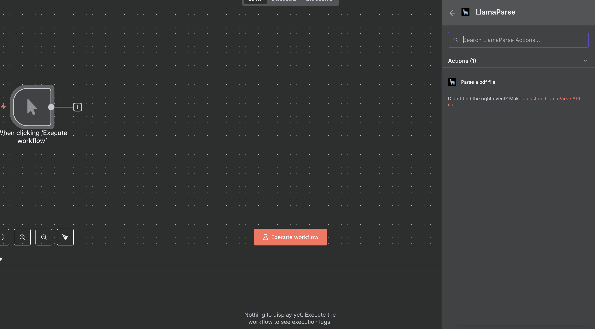
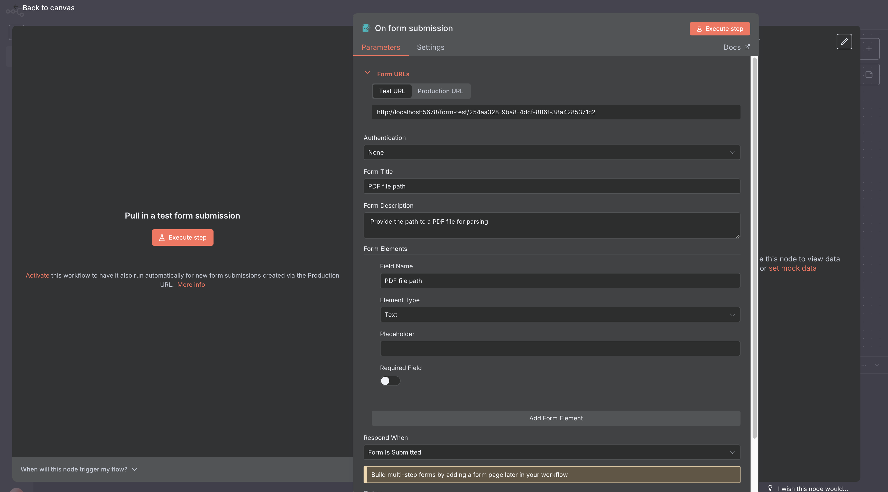
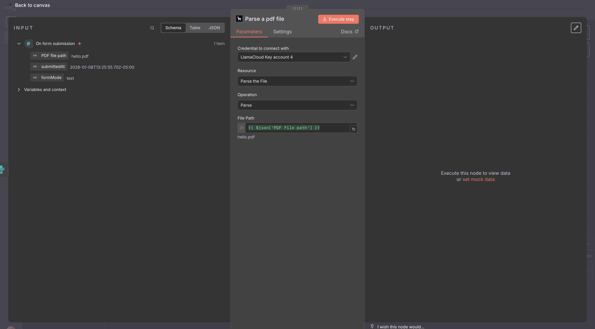

# LlamaParse n8n setup

You can setup LlamaParse by choosing the `LlamaParse` node and the `Parse PDF File` action:

And, once you selected that, you can specify a file path to parse:

Or add it dynamically from another source you can use as trigger, such as an n8n Form:

And you can employ the form output as input for LlamaParse:

---

### View Also:

- [LlamaCloud Index setup](./llamacloud_index.md)
- [LlamaExtract Setup](./llamaextract.md)
- [LlamaClassify n8n setup](./llamaclassify.md)
- [LlamaSheets n8n setup](./llamasheets.md)
- [Setting up LlamaCloud nodes](./index.md)
- [Back to top](#llamaparse-n8n-setup)
