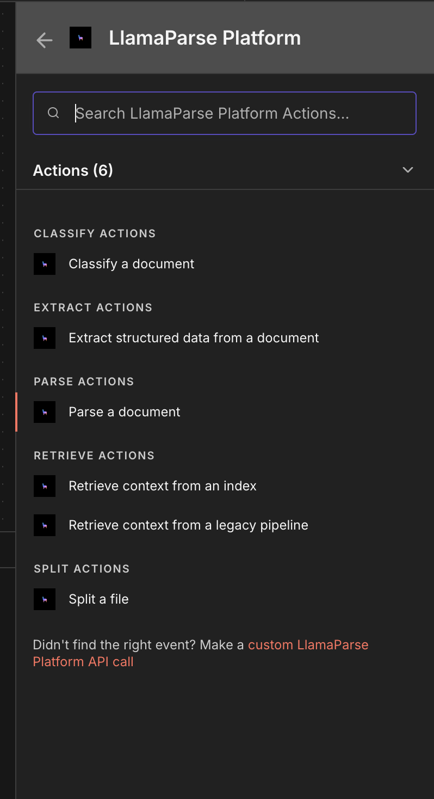
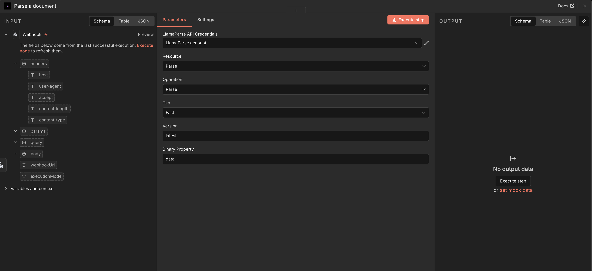
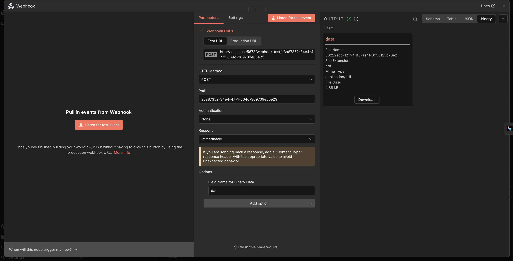
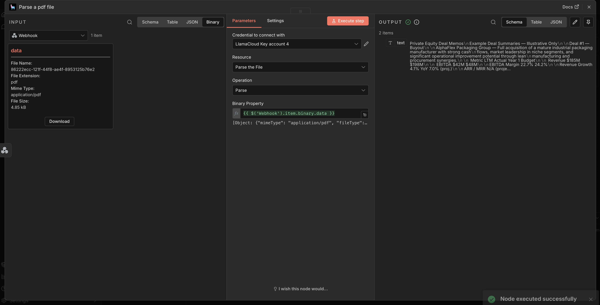

# Parse n8n setup

You can setup Parse by choosing the 'Parse a document' action from the LlamaParse Platform node:



And, once you selected that, you can specify file binary data to parse, as well as parsing tier and version:



For binary data, it is best to dynamically fetch them from another source (trigger), such as a WebHook:



In this example, you can send a PDF directly with a `curl` request:

```bash
curl -X POST \
  -H "Content-Type: application/pdf" \
  --data-binary @document.pdf \
  http://localhost:5678/<YOUR_WEBHOOK_NAME>/<YOUR_WEBHOOK_PATH>
```

And you can take the webhook output as input for Parse:



---

### View Also:

- [Index v2 n8n setup](./llamacloud_indexv2.md)
- [Extract Setup](./llamaextract.md)
- [Classify n8n setup](./llamaclassify.md)
- [Split n8n setup](./llamasplit.md)
- [Setting up LlamaParse Platform nodes](./index.md)
- [Setup with Docker](./docker.md)
- [Back to top](#llamaparse-n8n-setup)
