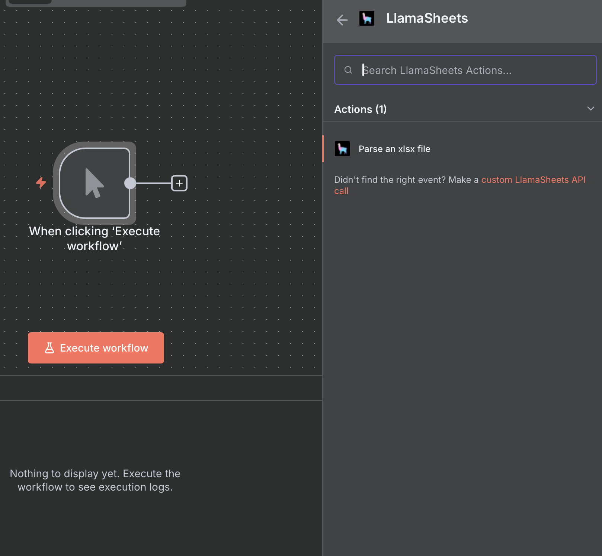
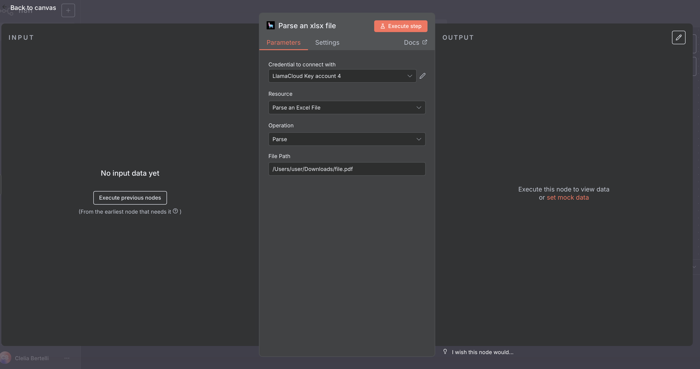

# LlamaSheets Setup in n8n

## Setup

Select the 'LlamaSheets' node with the 'Parse an xlsx file' action.

When setting up the node, simply provide the path to a file:

As for LlamaParse, you can also set the node to receive inputs from other nodes, such as a n8n form.

---

### View Also:

- [LlamaParse n8n setup](./llamaparse.md)
- [LlamaCloud Index setup](./llamacloud_index.md)
- [LlamaExtract n8n setup](./llamaextract.md)
- [LlamaClassify n8n setup](./llamaclassify.md)
- [Setting up LlamaCloud nodes](./index.md)
- [Back to top](#llamasheets-setup-in-n8n)
