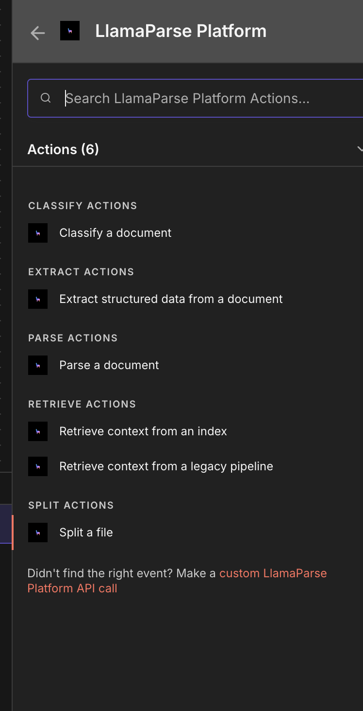

# Split Setup in n8n

## Setup

Select the 'Split a file' action from the LlamaParse Platform node:

When setting up the node, provide the binary data of a file and the categories according to which the file should be split:

As for LlamaParse, you can also set the node to receive inputs from other nodes, such as a webhook.

---

### View Also:

- [LlamaParse n8n setup](./llamaparse.md)
- [LlamaCloud Index v1 n8n setup](./llamacloud_index.md)
- [LlamaCloud Index v2 n8n setup](./llamacloud_indexv2.md)
- [LlamaExtract n8n setup](./llamaextract.md)
- [LlamaClassify n8n setup](./llamaclassify.md)
- [Setting up LlamaParse Platform nodes](./index.md)
- [Setup with Docker](./docker.md)
- [Back to top](#llamasheets-setup-in-n8n)
