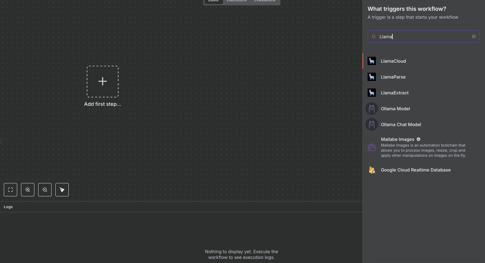
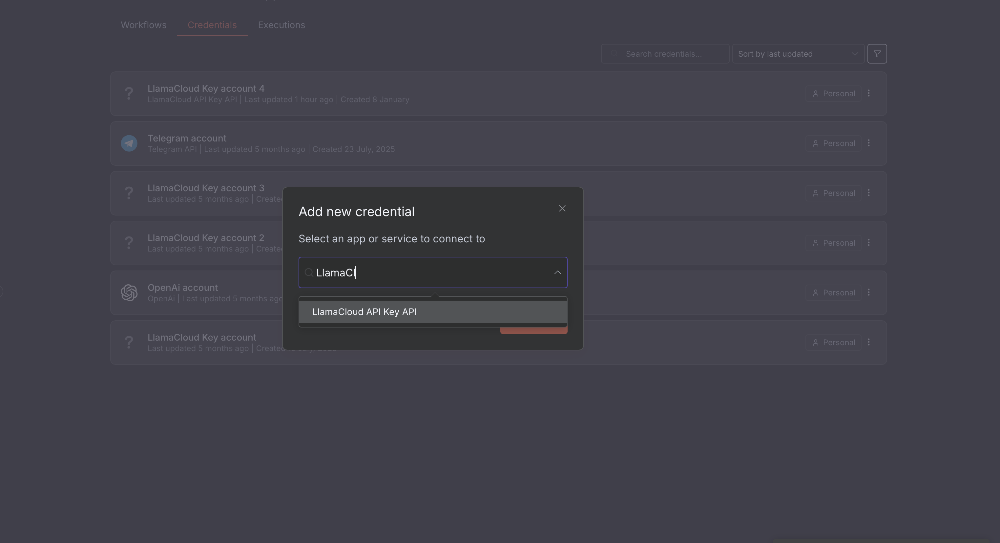
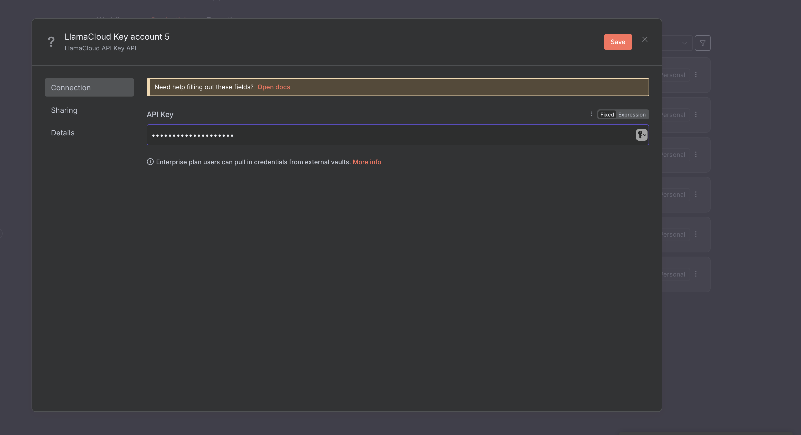

# Setting up LlamaCloud nodes for n8n

In order to set up LlamaCloud nodes for n8n, you first need to install them via `npm` (or another package manager of the Javascript/Typescript ecosystem):

```bash
npm install -g @llamaindex/n8n-nodes-llamacloud
```

Once they are installed, you can go to your `$HOME/.n8n` directory and link the node package from there:

```bash
cd $HOME/.n8n
mkdir custom/
cd custom/
npm link @llamaindex/n8n-nodes-llamacloud
```

And then you can start n8n:

```bash
n8n start
```

And LlamaCloud Nodes will be available:



In order to interact with LlamaCloud, you will need credentials (grab or create yours from [LlamaCloud Platform](https://cloud.llamaindex.ai)).

On n8n's dashboard, select "Create Credentials" and then select "LlamaCloud API Key":



Paste your API key and save:

